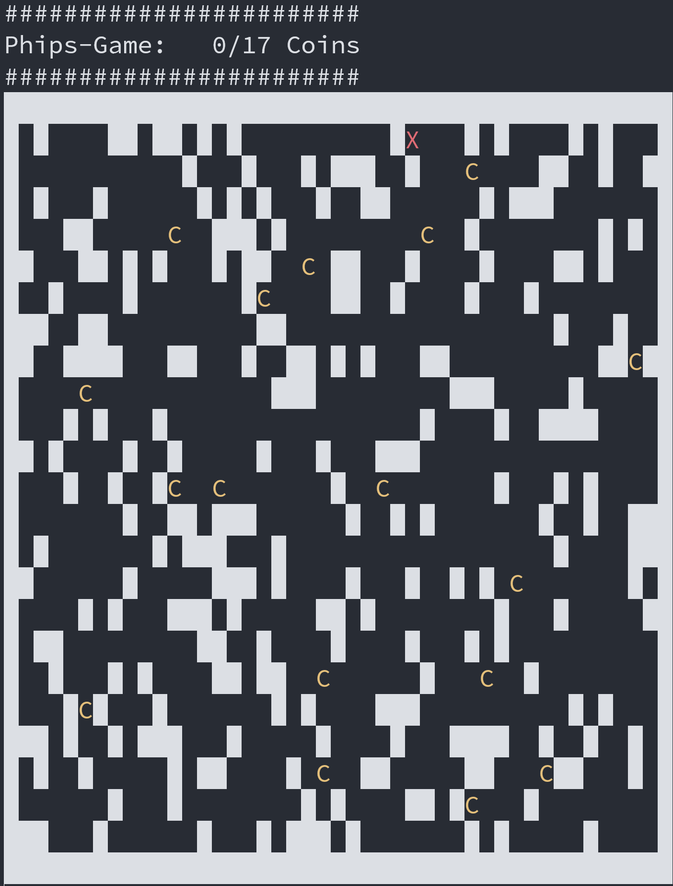

# Phips CLI Game
Hi! This is a simple just for fun game you can play inside your Terminal 
with your XBox Controller. It definitely works on Windows. In theory it should
work on MacOS too, but somehow the library doesn't find the xBox controller there...

You can walk around and collect coints. For each coin the controller gives you a 
light force feedback. Each time you hit the barrier you get a strong force feedback.

### How to build/start
This is written in Rust. Make sure you have rustup/cargo installed. Clone this
repository and `$ cargo run --release`. You must have an xbox controller attached
to your system, e.g. via bluetooth.

### Screenshot
- Player (X) is red
- Coins (C) are yellow/godl
- Barriers are white

